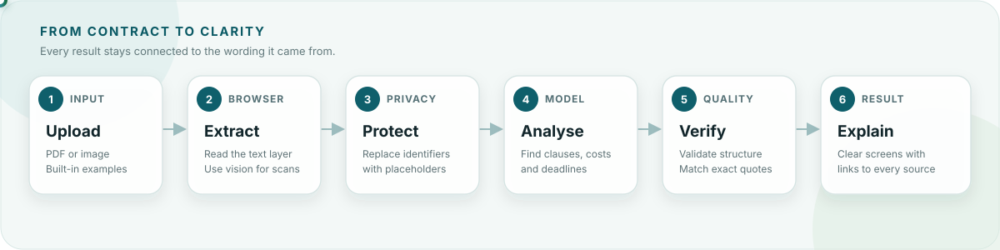

<div align="center">
  

  <h1>SignWise</h1>

  <h3>AI-Powered Contract Understanding</h3>

  <p>
    <b>Understand your contract before you sign it.</b>
  </p>

  <p>
    <a href="https://signwise-hero-7c21.azurewebsites.net">
      
    </a>
    <a href="https://www.typescriptlang.org/">
      
    </a>
    <a href="https://react.dev/">
      
    </a>
    <a href="https://vite.dev/">
      
    </a>
  </p>
</div>

---

SignWise turns a German or English contract into a clear, traceable explanation.
Upload a document, see the costs, deadlines and obligations that matter, and open
the exact clause behind every finding.

**[Try the live demo](https://signwise-hero-7c21.azurewebsites.net/)** — no upload
is required; rental and employment examples are included.

## What SignWise gives you

- **A quick overview** of important costs, dates and responsibilities.
- **Plain-language explanations** at Simple, Standard or Detailed depth.
- **The complete contract text**, with every section linked to its explanation.
- **A before-you-sign brief** with commitments, review points and useful questions.
- **Contract-based answers** that link back to the supporting clause.
- **German and English** throughout the experience.

SignWise explains what the document says. It does not decide whether a clause is
valid, provide legal advice or tell you whether to sign.

## How it works



1. **Upload** — choose a PDF or image, or open a built-in example.
2. **Extract** — readable PDF text is extracted in the browser; scans use vision.
3. **Protect** — common identifiers in extracted text are replaced with placeholders
   before the request and restored in the browser afterwards.
4. **Analyse** — Azure OpenAI returns a structured explanation of every contract
   section, including findings, money, dates and source references.
5. **Verify** — Zod validates the response and SignWise checks every quoted passage
   against the uploaded document.
6. **Explain** — the verified result appears in Overview, Contract Text and Before
   You Sign.

Scanned images cannot be pseudonymised before vision processing, because they have
no text layer. The upload screen states this clearly.

## The three screens

### Overview

The main facts, important findings, costs and deadlines—each linked to its source.

### Contract text

The complete document split into readable sections. Select any section to see its
plain-language explanation beside the original wording.

### Before you sign

A practical summary of your commitments, points worth reviewing and questions to
clarify with the other party.

## Run locally

You need Node.js 20 or newer.

```bash
npm install
npm run dev
```

Open <http://localhost:5173> and choose one of the example contracts.

```bash
npm test       # automated checks
npm run build  # type-check and create the production build
```

The examples work without an API key.

## Connect Azure OpenAI

Copy [`.env.example`](.env.example) to `.env.local` and add:

```env
AZURE_OPENAI_ENDPOINT=https://your-resource.openai.azure.com
AZURE_OPENAI_API_KEY=your-key
AZURE_OPENAI_DEPLOYMENT=your-deployment-name
AZURE_OPENAI_API_VERSION=2025-01-01-preview
```

The model integration is isolated in [`api/_model.ts`](api/_model.ts). If the
credentials are missing, SignWise safely falls back to the built-in demo data.

## Project structure

```text
api/                  Model-backed analyse, ask and translate endpoints
src/screens/          Upload, progress, overview, contract and decision screens
src/components/       Shared interface components
src/types.ts          Zod schema shared by the API and interface
src/redact.ts         Browser-side identifier pseudonymisation
src/verify.ts         Verbatim quote verification
src/depth.ts          Explanation-depth consistency checks
src/lawcheck.ts       General statutory comparisons without legal verdicts
scripts/              Demo and model audit scripts
server.ts             Express server for the SPA and API on Azure
```

## Deploy to Azure App Service

SignWise runs as one Node process: Express serves the built React app and the three
API endpoints.

1. Create a Linux Web App using Node.js 20 or newer.
2. Set the startup command to `npm start`.
3. Add the Azure OpenAI variables in the Web App settings.
4. Deploy the repository with build-on-deploy enabled.

For zip deployments, use `--clean true` so files removed from the repository do not
remain on the server.

## Useful technical notes

- [`docs/data-fidelity-pass.md`](docs/data-fidelity-pass.md) explains the checks that
  keep figures and quotes tied to the contract.
- [`docs/qa-end-user-pass.md`](docs/qa-end-user-pass.md) records the end-user QA pass.
